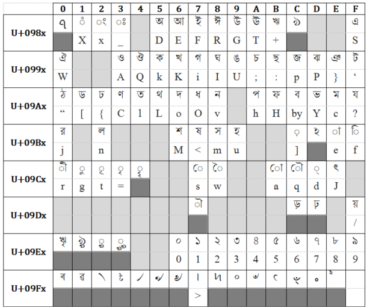

# kybd-mm

Meetei/Meitei Mayek Character Keyboard.

This directory contains khut_e.zip from which you can extract and install Meetei Mayek in Windows.
Installing khut_e will allow you to type in Meetei Mayek in windows.

## 1. Keys

### 1.1. Normal Mode

### 1.2. Shift Mode

Hold Shift and Type.

### 1.3. Ctrl Mode

Hold Ctrl and Type. (Might not probably work if Ctrl is bound as part of shortcuts, eg., Ctrl+Z is undo so typing Z might not work.)

## 2. Font

Nirmala UI supports Meetei Mayek by default in windows. But it is preferred to download and install [Noto Sans Meetei Mayek](https://fonts.google.com/noto/specimen/Noto+Sans+Meetei+Mayek) from Google Fonts.

## 3. BONUS: Bengali Keymap (Windows Default)

Since Meiteilon was typed in Bengali, given below is the Keymap to type bengali characters using QWERTY keyboard.

## Warning

- The character in the keyboard is not in the default system code page (1252) of the English (India) language you specified. This may cause compatibility problems in non-Unicode applications.

## See also

- [Speech Dataset](https://github.com/hoomexsun/speech_dataset).
- [Meetei/Meitei Mayek Transliteration](https://github.com/hoomexsun/mm_transliteration).
- [Meetei/Meitei Mayek Keyboard for Windows](https://github.com/hoomexsun/mm_keyboard).
- [IPA Keyboard for Windows](https://github.com/hoomexsun/ipa_keyboard).
- [S-550 Glyph Correction](https://github.com/hoomexsun/s550_glyph_correction).
- [Epaomayek Glyph Correction](https://github.com/hoomexsun/epaomayek_glyph_correction).
