# kybd-mm

Meetei/Meitei Mayek Character Keyboard.

This repository contains resources from which you can extract and install Meetei Mayek keyboard in Windows/Ubuntu.

- Download and install `khut_e.zip` for **windows**
- Download and install `Eeyek-2.0.zip` for **ubuntu** (Built by [Tabish](http://tabish.freeshell.org/eeyek/download.html))

## 1. Setup Instructions (khut_e)

1. Download and extract **khut_e.zip**
2. Run `setup.exe` and install the khut_e font.
3. Press `Windows` + `Spacebar` to change Language

   

4. You can type in **MS Office** apps by default (MS Word, MS Powerpoint, MS Excel). Check out Section 3 for other use cases.

## 2. Keyboard Layouts

Nirmala UI supports Meetei/Meitei Mayek by default in windows. But it is preferred to download and install [Noto Sans Meetei Mayek](https://fonts.google.com/noto/specimen/Noto+Sans+Meetei+Mayek) from Google Fonts.

This repository also contain a copy of [Eeyek font](http://tabish.freeshell.org/eeyek/download.html) which can be used to type Meetei/Meitei Mayek in Ubuntu OS.

### 2.1 Windows (khut_e)

#### 2.1.1. Normal Mode

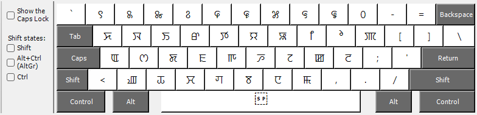

#### 2.1.2. Shift Mode

Hold `Shift` and Type.

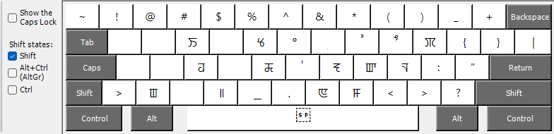

#### 2.1.3. Ctrl Mode

Hold `Ctrl` and Type. (Might not probably work if `Ctrl` is bound as part of shortcuts, eg., `Ctrl`+`Z` is undo so typing `Z` might not work.)

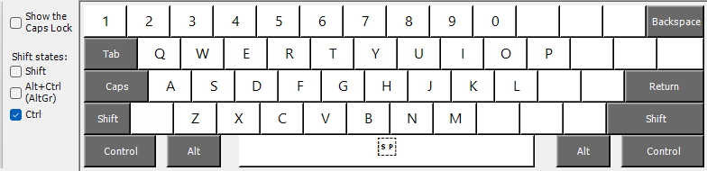

### 2.2. Linux/Ubuntu (Eeyek)

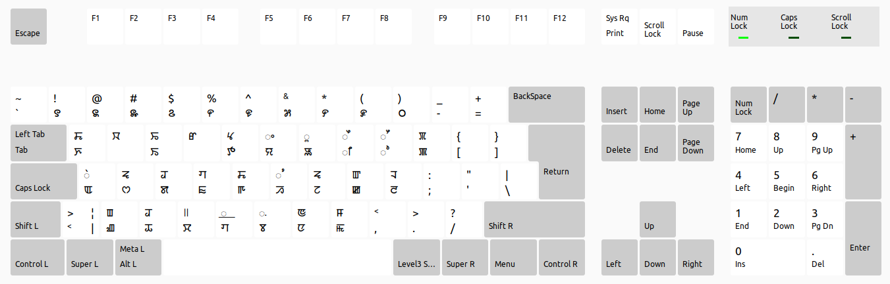

## 3. Use cases in Windows

### 3.1. Typing in Notepad

You can type Meitei Mayek in notepad as shown below

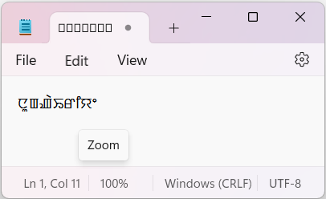

1. If the characters are invisible go to **Edit**

   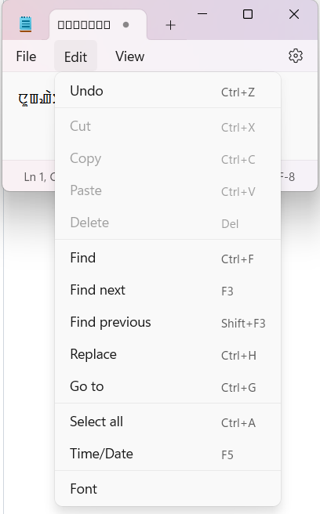

2. Pick font family **Noto Sans Meetei Mayek**

   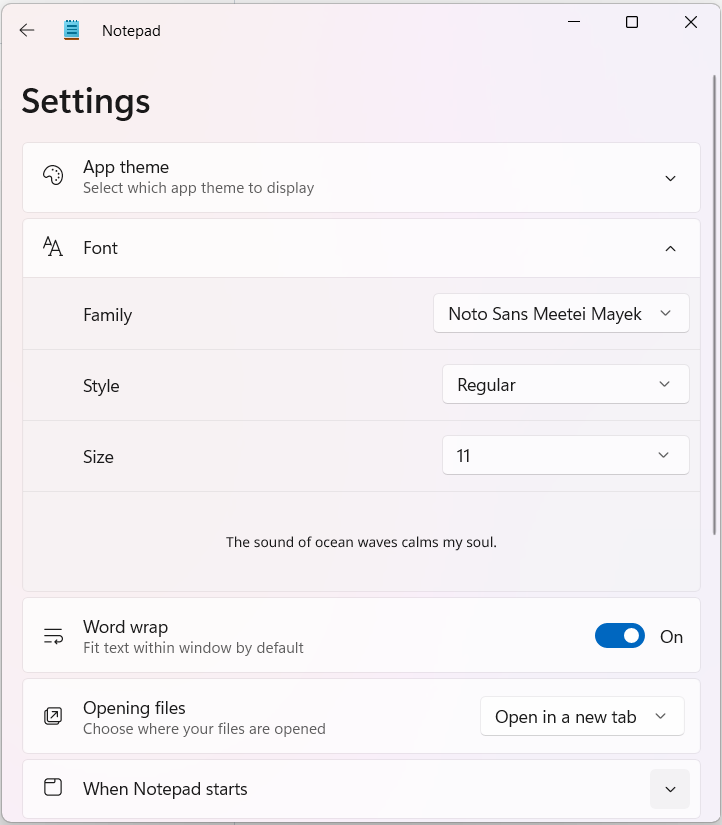

### 3.2. Typing in Google Chrome

1. **Settings** > **Appearance** > **Customize fonts** or type **chrome://settings/fonts** in search bar and press `Enter`
2. **Customize fonts** > **Standard font** > pick **Noto Sans Meetei Mayek**

   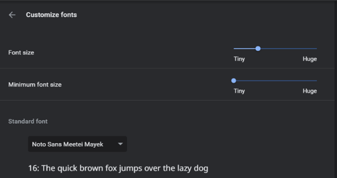

3. Screenshot of Typing

   

### 3.3. Typing in VS Code

1. Click on **File**

   

2. Go to **Preferences**

   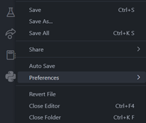

3. Go to **Settings**

   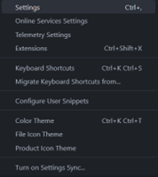

4. Add **Noto Sans Meetei Mayek** in **Font** of **User** Settings

   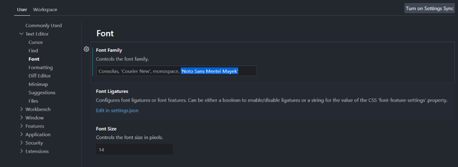

5. Screenshot of Typing

   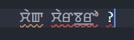

### 3.4. Typing in Google Collab/Jupyter Notebook

Similar to **Section 3.2.**

### 3.5. Typing in LaTeX

1. Install [MikTeX](https://miktex.org/download) and [TexMaker](https://www.xm1math.net/texmaker/download.html) to edit LaTeX files.
2. Install Meetei Mayek Unicode fonts ([Noto Sans Meetei Mayek](https://fonts.google.com/noto/specimen/Noto+Sans+Meetei+Mayek)).
3. Install `khut_e` to type Meetei Mayek Unicode in Windows. (Refer Section 2)
4. Make the following changes (highlighted)
   a. Create a new LaTeX file and add fontspec package.
   b. Create a new font family, add a preferred name (eg., \MM) and use Noto Sans Meetei Mayek (check spelling and cases).
   c. Use {\MM type the chracters here}
   d. You can type the characters using Khutyee in windows or using Eeyek in Ubuntu
   e. You can also use LaTeX \char to type the characters using the actual Unicode values.

   ```latex
   \documentclass[12pt,a4paper]{article}
   \usepackage{fontspec}
   \newfontfamily\MM{Noto Sans Meetei Mayek}

   \begin{document}

   {\MM
   ꯀ ꯁ ꯂ ꯃ ꯄ ꯅ
   \char"ABC0
   }

   \end{document}
   ```

5. Change Compiler of Tex file in TexMaker to XeTeX or LuaTeX to use fontspec.
6. In Word Processor like MS Word, WordPad etc. Nirmala UI, Eeyek or Noto Sans Meetei Mayek is required to show the proper glyphs (else Unicode empty blocks will show up).
7. Same steps for **TexMaker** and **Overleaf** (Don’t forget to change compiler to **LuaLaTeX**).

(_Example_)

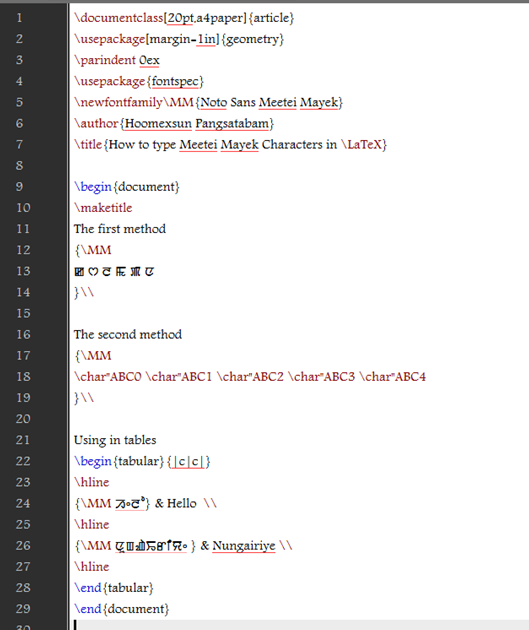

#### 3.5.1. Overleaf

(_Setting Compiler to LuaLaTeX in Overleaf_)

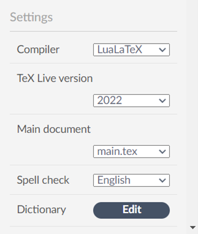

(_Output pdf_)

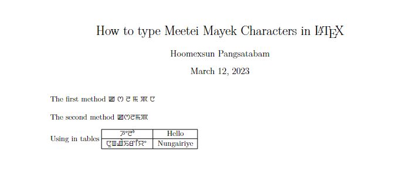

#### 3.5.2. TexMaker

(_Setting Compiler to LuaLaTeX in TexMaker_)

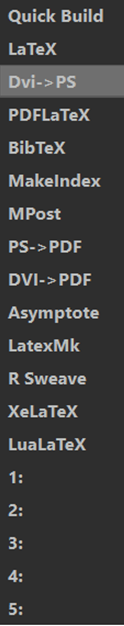

(_Output pdf_)

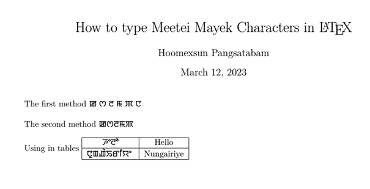

## 4. FAQs

### 4.1. How do i go back to my usual keyboard?

Press `Windows` + `Spacebar` again till you change it back for both **windows** and **ubuntu**.

### 4.2. Only boxes are displayed instead of the correct characters while typing?

If the glyphs are not visible in **notepad**, you can check the font first (select Noto Sans Meetei Mayek) in newer version or fix it by typing using the font in any other app which can display Meitei Mayek by default (eg., MS Word) in older version.

## Disclaimer

If the software you are using doesn't support font, then the character will only appear as boxes or boxes with ?.

## Warning

- The character in the keyboard is not in the default system code page (1252) of the English (India) language you specified. This may cause compatibility problems in non-Unicode applications.

## See also

- [Speech Dataset](https://github.com/hoomexsun/speech_dataset).
- [Meetei/Meitei Mayek Transliteration](https://github.com/hoomexsun/mm_transliteration).
- [Meetei/Meitei Mayek Keyboard for Windows](https://github.com/hoomexsun/mm_keyboard).
- [IPA Keyboard for Windows](https://github.com/hoomexsun/ipa_keyboard).
- [S-550 Glyph Correction](https://github.com/hoomexsun/s550_glyph_correction).
- [Epaomayek Glyph Correction](https://github.com/hoomexsun/epaomayek_glyph_correction).
- [Microsoft Keyboard Layout Creator](https://www.microsoft.com/en-us/download/details.aspx?id=102134)
